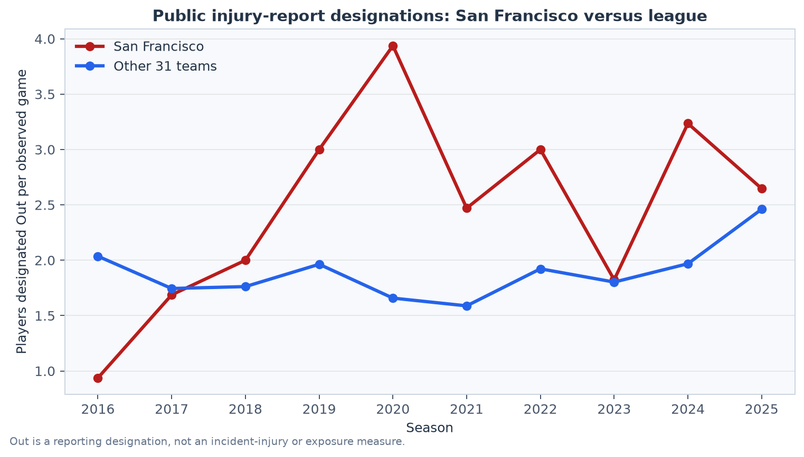
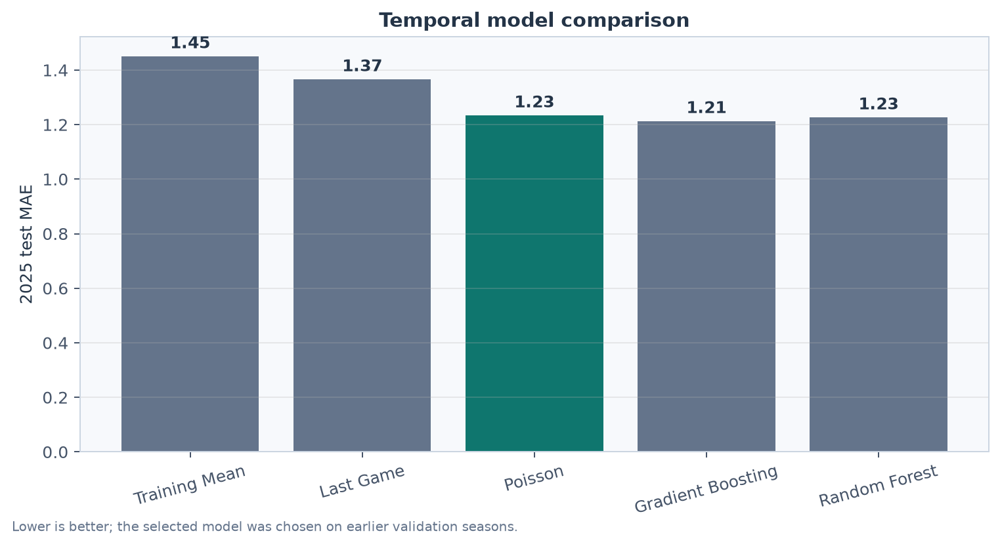
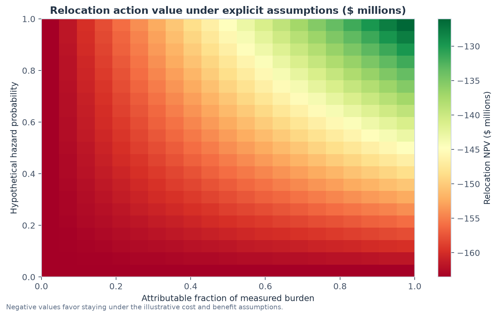

# NFL Player Availability and Facility-Risk Decision Support

[](https://github.com/brockjohnson138/nfl-facility-decision-support/actions/workflows/ci.yml)

This project asks a decision-analysis question: **what evidence would justify staying, commissioning further study, or relocating an NFL practice facility when player-availability reporting appears unusual?** It is a public-data portfolio project, not a medical study and not a claim that electromagnetic fields cause injuries.

## Results at a glance

The current snapshot covers ten completed seasons, 2016–2025.

| Result | Estimate |
| --- | ---: |
| San Francisco mean players designated Out per observed game | **2.47** |
| Other 31 teams mean per observed game | **1.89** |
| San Francisco decade rank on this reporting measure | **3rd** |
| Poisson test MAE | **1.23** |
| Training-mean baseline test MAE | **1.45** |
| Baseline scenario preferred action | **Stay** |

The comparison is descriptive: **Out** is a weekly report designation, not incident injuries, games missed, injured-reserve burden, or an exposure effect. The relocation result is a hypothetical financial scenario. It should not be interpreted as evidence that a facility is safe or unsafe.







## What the pipeline does

1. Downloads public nflverse injury-report, weekly-roster, schedule, and contract snapshots.
2. Records URLs, retrieval times, file sizes, and SHA-256 hashes for provenance.
3. Builds an auditable team-game panel while documenting missing reports, changing abbreviations, and ambiguous public fields.
4. Benchmarks San Francisco against other teams under several outcome definitions.
5. Trains Poisson, gradient-boosting, and random-forest models with season-aware temporal validation.
6. Reports empirical intervals and test-season metrics without turning predictive associations into causal claims.
7. Compares stay, investigate, and relocate actions under explicit user-entered hazard and financial assumptions.

## The evidence boundary

The project deliberately does **not** estimate an electromagnetic causal effect. A nearby substation is not an exposure measurement, and the public files do not contain validated exposure histories, clinical diagnoses, workloads, exact onset dates, or injury mechanisms. No numerical hazard probability is learned from the injury reports. Scenario probabilities and relocation costs are assumptions that show how a decision would change if better evidence became available.

The most useful real-world output is therefore the break-even analysis: how large the probability of a genuine hazard and the attributable reduction in the measured burden would need to be before relocation pays for itself. The current baseline scenario stays below that threshold because the illustrative relocation cost is much larger than the modeled annual benefit. That is a scenario result, not an organizational recommendation.

## Reproduce the analysis

```bash
python -m venv .venv
source .venv/bin/activate
python -m pip install -r requirements.txt
python run_pipeline.py
python scripts/make_figures.py
python -m pytest -q
```

Existing downloads are reused. The acquisition step can refresh the public snapshot; provenance and SHA-256 hashes are written to `data/source_manifest.json`. The public repository intentionally excludes player-level health and compensation records.

## Repository map

```text
src/                  acquisition, preparation, analysis, models, finance, decision logic
data/                 public source snapshots and processed aggregate tables
outputs/              findings, metrics, model card, simulations, and decision grids
docs/EVIDENCE.md      sources, definitions, and acquisition gaps
docs/PORTFOLIO.md     concise portfolio framing
docs/figures/         generated figures used in this README
scripts/              reproducible figure generation
tests/                decision-rule tests
```

Key artifacts:

- [`findings.json`](outputs/findings.json) — San Francisco versus league comparison and bootstrap interval;
- [`test_metrics.csv`](outputs/test_metrics.csv) — held-out 2025 model performance;
- [`model_card.json`](outputs/model_card.json) — target definition, features, validation design, and limits;
- [`decision_sensitivity.csv`](outputs/decision_sensitivity.csv) — action values across hazard assumptions; and
- [`data/source_manifest.json`](data/source_manifest.json) — source provenance and hashes.

## Limitations and next evidence

The public outcome is a reporting measure, not a complete injury series. Reporting rules changed in 2016, adjacent seasons may be dependent, and the ten-season bootstrap interval is descriptive. Contract values are publisher or upstream snapshots rather than audited team financials. A real facility decision would require calibrated field measurements, consent-governed clinical records, player time-at-site histories, workload data, site-specific bids, and a pre-specified causal study design.

See [`docs/EVIDENCE.md`](docs/EVIDENCE.md) for the evidence register and acquisition gaps, and [`docs/PORTFOLIO.md`](docs/PORTFOLIO.md) for a concise project description.
